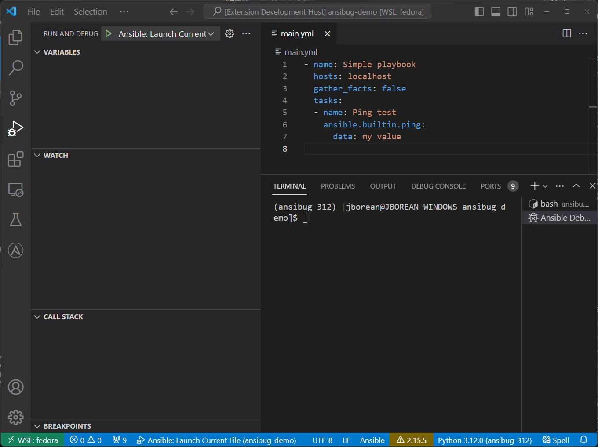

# VSCode Extension for Debugging Ansible Playbooks
This extension add debugging support for Ansible playbooks to Visual Studio Code.
This extension has no official affiliation or endorsement with Ansible and Red Hat and is a community project.

## Features
Debugging support comes from the [ansibug](https://pypi.org/project/ansibug/) Python module.
It can set breakpoints through Ansible playbook and task files and step through the tasks inside that file like a normal debugger.

See the [ansibug documentation](https://ansible-community.github.io/ansibug/) for more information on how this works with Ansible.

## Requirements
The following Python requirements must be met before using this extension:

+ [ansibug](https://github.com/ansible-community/ansibug)
+ `Ansible` must also be installed for `ansibug` to interact with

For Windows users, this extension can be used with remote extensions like `Remote -WSL`, `Remote - SSH`, and `Remove - Containers`.
This extension can run alongside the official [vscode-ansible](https://github.com/ansible/vscode-ansible) extension.

## Extension Settings
This extension contributes the following settings:

+ `ansibug.interpreterPath`: Path to the `python`/`python3` executable where Ansible and `ansibug` is installed
+ `ansibug.logFile`: Path to a log file to store any logging information during a run
+ `ansibug.logLevel`: The logging level to configure for the debug server

This extension will also use the setting `ansible.python.interpreterPath` set by the official `vscode-ansible` extension as a fallback value for `ansibug.interpreterPath`.
